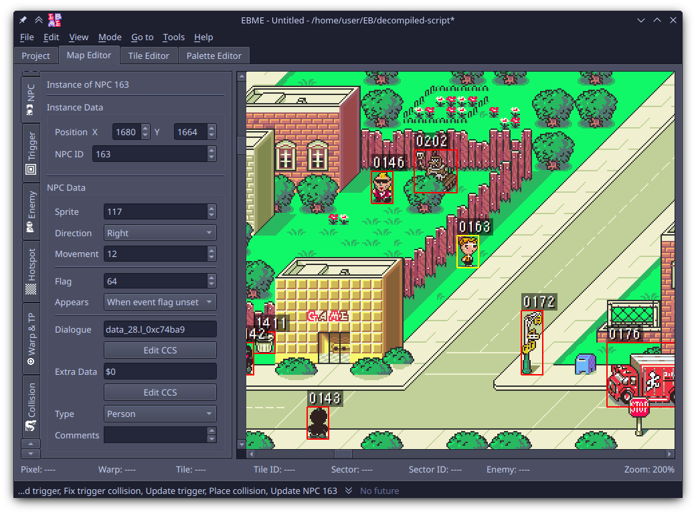

<h1 align="center">EarthBound Map Editor</h1>

A GUI program to edit the overworld areas of _EarthBound_, written in Python.

Edits [CoilSnake](https://github.com/pk-hack/CoilSnake) projects.

## Features

* Edit object data in-program (such as NPC data)
* Select and edit multiple objects at once
* Convert PNG files to tilesets and place them visually
* Undo/redo almost everything
* Leave comments on some objects
* Rearrange minitiles in tilesets
* Preview foreground-layer graphics
* Add, delete, export, and import palettes
* Draw collision directly onto the map

## Downloads

Stable release executables for Windows and Linux are available in the [releases tab](https://github.com/Supremekirb/EBME/releases).
MacOS users will have to download the source code themselves. See [DEVELOPMENT.md](DEVELOPMENT.md).

If you want development builds, you can get the latest one [from nightly.link here](https://nightly.link/Supremekirb/EBME/workflows/build_push/main). Note that these may contain bugs and unfinished features! You can also access development builds [on GitHub here](https://github.com/Supremekirb/EBME/actions) by opening the workflow run you want.

## Screenshots

